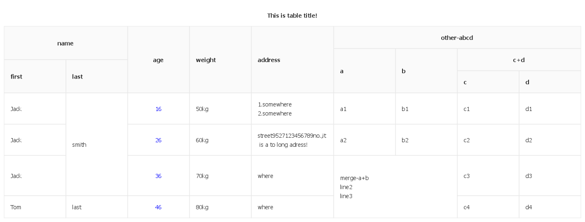

`Draw table on canvas! Can be used both of node and browser.`

## Install
- node (Must install [canvas](https://www.npmjs.com/package/canvas "canvas"))
`npm install canvas table2canvas` or `yarn add canvas table2canvas`

- browser
`npm install table2canvas` or `yarn add table2canvas`

## Usage
- node
```js
import { Canvas } from 'canvas';
import Table2canvas from 'table2canvas';
import fs from 'fs';

const columns = [
    {
        title: 'name', children: [
            {
                title: 'first',
                dataIndex: 'first'
            },
            {
                title: 'last',
                dataIndex: 'last',
                render: (text, row, i) => {
                    if (i === 0) {
                        return { text, rowSpan: 2 }
                    }
                    if (i === 1) {
                        return { text, rowSpan: 0 }
                    }
                    return text;
                }
            }
        ]
    },
    { title: 'age', dataIndex: 'age', textAlign: 'center', textColor: 'blue' },
    { title: 'weight', dataIndex: 'weight', render: '{c}kg' },
    { title: 'address', dataIndex: 'address', width: 200 },
    {
        title: 'other-abcd', children: [
            {
                title: 'a',
                dataIndex: 'a',
                render: (text, row, i) => {
                    if (i === 2) {
                        return { text, colSpan: 2, rowSpan: 2 }
                    }
                    if (i === 3) {
                        return { text, colSpan: 0, rowSpan: 0 }
                    }
                    return text;
                }
            },
            {
                title: 'b',
                dataIndex: 'b',
                render: (text, row, i) => {
                    if (i === 2 || i === 3) {
                        return { text, colSpan: 0, rowSpan: 0 }
                    }
                    return text;
                }
            },
            {
                title: 'c+d',
                dataIndex: 'c',
                children: [
                    {
                        title: 'c',
                        dataIndex: 'c'
                    },
                    {
                        title: 'd',
                        dataIndex: 'd'
                    }
                ]
            }
        ]
    }
]

const dataSource = [
    { first: 'Jack', last: 'smith', age: 16, weight: 50, address: 'where', a: 'a1', b: 'b1', c: 'c1', d: 'd1' },
    { first: 'Jack', last: 'smith', age: 26, weight: 60, address: 'where', a: 'a2', b: 'b2', c: 'c2', d: 'd2' },
    { first: 'Jack', last: 'last', age: 36, weight: 70, address: 'where', a: 'merge-a+b', b: 'merge-a+b', c: 'c3', d: 'd3' },
    { first: 'Tom', last: 'last', age: 46, weight: 80, address: 'where', a: 'merge-a+b', b: 'merge-a+b', c: 'c4', d: 'd4' },
]

const table = new Table2canvas({
    canvas: new Canvas(2, 2),
    columns: columns,
    dataSource: dataSource,
    bgColor: '#fff',
})

const buffer = table.canvas.toBuffer();

fs.writeFileSync('demo.png', buffer);
```

result:demo.png


- browser
```js
import Table2canvas from 'table2canvas';

const columns = [...]

const dataSource = [...]

const table = new Table2canvas({
    canvas: document.createElement('canvas'),
    ...     
});

document.body.appendChild(table.canvas);
```

## Options

### TableOpt

| Property | Description | type |  Default | Required |
| :----: | :----: | :----: | :----: | :----: |
| canvas | Draw table to whitch canvas | Canvas \| HTMLCanvasElement | - | yes |
| bgColor | canvas's background color | string | 'transparent' | no |
| padding | Table in canvas's padding | number \| number[] | 10 | no |
| columns | columns config |  IColumn[] | - | yes |
| dataSource | dataSource for table | Record<string,any> | - | - |
| style | Table's style | TableStyle | ... | no |
| text | Table's title | string | - | no |
| textStyle | Table's title style(color,fontSize,textAlign) | TextStyle | ... | no |

### IColumn

| Property | Description | type |  Default | Required |
| :----: | :----: | :----: | :----: | :----: |
| title | Table's td text | string | - | yes |
| titleColor | title's color | string | 'rgba(0,0,0,0.85)' | no |
| dataIndex | Display field of the data recordg |  string | - | no |
| textAlign | The specify which way that column is aligned | 'left' \| 'right' \| 'center' | 'left' | no |
| textColor | Color of column's body | string | 'rgba(0,0,0,0.85)' | no |
| width | Width of this column | number | defaultStyle.columnWidth | no |
| children | Group table head | IColumn[] | - | no |
| render | custom render,if is string,{c} is row[dataIndex] | string \| Function | - | no |

### TableStyle

| Property | Description | type |  Default | Required |
| :----: | :----: | :----: | :----: | :----: |
| headerRowHeight | height of header cell default value of rowHeight | number | 55 | no |
| rowHeight | height of each row | number | 55 | no |
| columnWidth | default width of all columns | number | 150 | no |
| borderColor | color of border | string | '#e8e8e8' | no |
| textAlign | The specify which way that column is aligned | string | 'left' | no |
| color | color of table | string | 'rgba(0,0,0,0.85)' | no |
| fontSize | fontSize of table | string | '14px' | no |
| fontFamily | fontFamily of table | string | 'sans-serif' | no |
| headerBgColor | background color of header cell | string | 'rgba(0,0,0,0.02)' | no |
| paddingLR | both left and right padding of table cell | number \| [number, number] | 8 | no |
